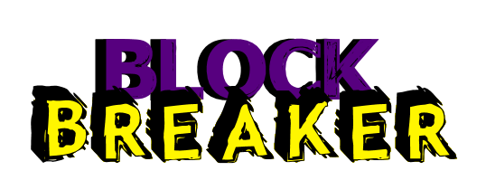
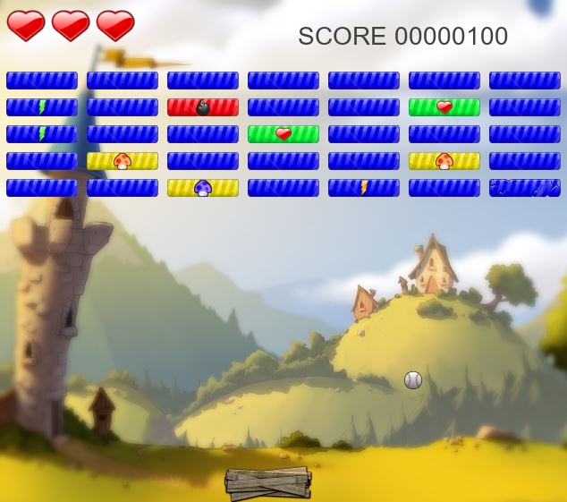

# Block Kreaker

Block Breaker é um jogo feito em Java, Swing e AWT que construí durante minha graduação, baseado no clássico [Breakout do Atari 2600](https://pt.wikipedia.org/wiki/Breakout_(jogo_eletr%C3%B4nico)).

Seu objetivo é destruir todos os blocos presentes na tela, usando uma bola que flutua nos limites da tela e que é rebatida através de uma plataforma localizada no inferior na tela, no qual você controla usando as teclas direacionais.

Alguns blocos possuem poderes especiais, tais como:

- Aumentar velocidade e tamanho da plataforma
- Aumentar velocidade e tamanho da bola
- Inserir mais bolas na tela
- Aumentar o poder destrutivo da bola

## Créditos

Background do mapa feito pelo [bvigec](https://www.deviantart.com/bvigec)

==Se você possui direito em alguns dos componentes gráficos usados nesse projeto e deseja que eles sejam creditados ou removidos, [entre em contato comigo](mailto:marcioaduil@gmail.com).==

## Principais comandos

| Ação                        | Comando                       |
| --------------------------- | ----------------------------- |
| Iniciar jogo                | <kbd>Space</kbd>              |
| Mover plataforma            | <kbd><-</kbd> e <kbd>-></kbd> |
| Pausar/Abrir menu principal | <kbd>ESC</kbd>                |

## Instruções

Executar o método `main` presente na classe `src/br/edu/eco405/blockbreaker/visual/JanelaJogo.java`

## Layout do mapa

Atualmente o jogo possui apenas uma fase. Porém, é possível personalizar o mapa de blocos alterando o arquivo `res/mapas/mapa1.txt`.

O mapa é composto por uma matriz 10x7 que pode ser preenchido **obrigatoriamente** com os seguintes valores a seguir:

| Valor | Tipo de bloco                                                 |
| ----- | ------------------------------------------------------------- |
| 1     | Bloco normal                                                  |
| 2     | Bloco com poder de aumentar vida em 1 un.                     |
| 3     | Bloco com poder de aumentar velocidade da plataforma em 1 un. |
| 4     | Bloco com poder de aumentar tamanho da plataforma em 1 un.    |
| 5     | Bloco com poder de aumentar dano da bola em 1 un.             |
| 6     | Bloco com poder de aumentar tamanho da bola em 1 un.          |
| 7     | Bloco com poder de aumentar velocidade da bola em 1 un.       |
| 8     | Bloco com poder de adicionar uma bola na tela                 |
| \#    | Bloco indestrutível                                           |
| \-    | Não imprime bloco na tela                                     |

## Screenshots

